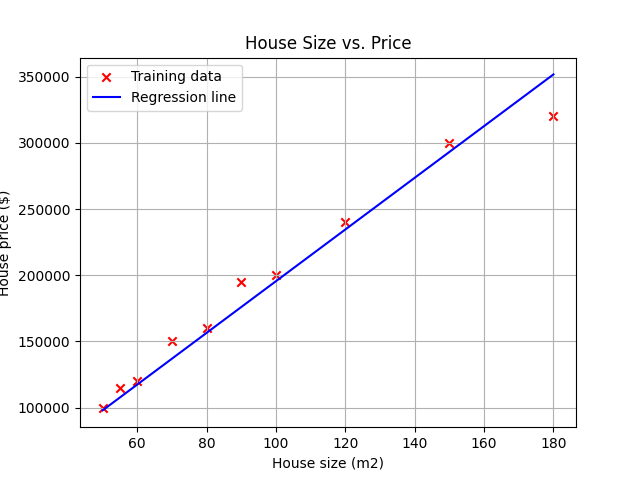

# House Price Prediction using Linear Regression Implemented from Scratch (No sklearn or other ML libraries)

This project implements **linear regression with one variable** from scratch using **gradient descent**, to predict house prices based on their size.

---

## Project Overview

- Built entirely with **NumPy, Pandas, and Matplotlib**
- Cost function and gradient descent **implemented manually**
- Visualizes the regression line over the training data
- Predicts the price of a house given its size

---

## Dataset

Simple CSV dataset with house sizes (in m²) and their corresponding prices (in $):

```csv
Size,Price
50,100000
55,115000
60,120000
70,150000
80,160000
90,195000
100,200000
120,240000
150,300000
180,320000
```

---

## Features

- ✅ Compute cost function \( J(w, b) \)
- ✅ Compute gradients algorithm
- ✅ Gradient descent optimization
- ✅ Plot of training data and regression line
- ✅ Price prediction for any given house size

---

## Example Output

```
Iteration    0: w = 771.50, b = 10.53, cost = 1636827132.85
...
Iteration 1000: w = 1695.84, b = 42424.62, cost = 27876469.96

Trained parameters: w = 1695.84, b = 42424.62
Prediction of a house price, size: 110 m2 is 215035.87 $.
```

---

## Visualization

The following plot shows the training data (red X) and the learned regression line (blue):



---

## Requirements

Install Python dependencies:

```bash
pip install numpy pandas matplotlib
```

Or use:

```bash
pip install -r requirements.txt
```

---

## Run the script

```bash
python house_prediction.py
```

---

## Learning Outcome

This project was done as part of practicing core concepts from **Andrew Ng’s Machine Learning course** including:

- Gradient descent
- Cost function understanding
- Feature-target mapping
- Plotting and model evaluation

---

## Author

- **Bakir Bećić**
- GitHub: [github.com/bakirbecicRI](https://github.com/bakirbecicRI)
- Year: 2025
